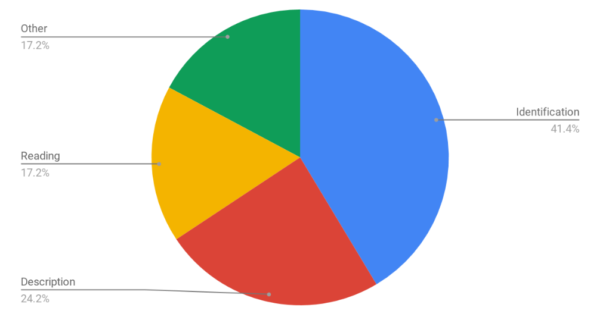
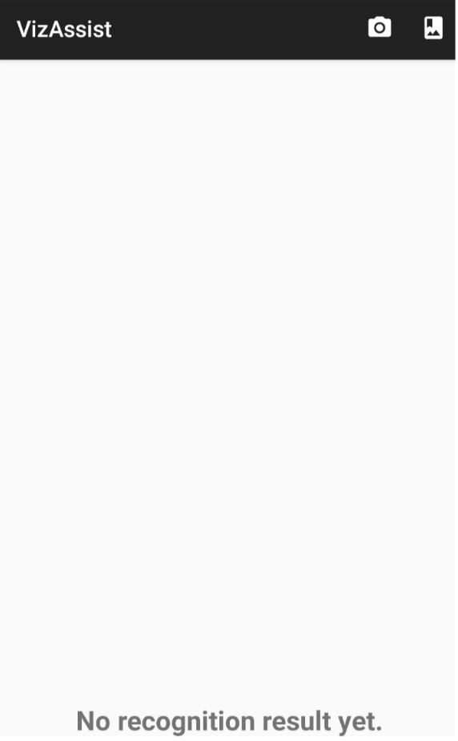
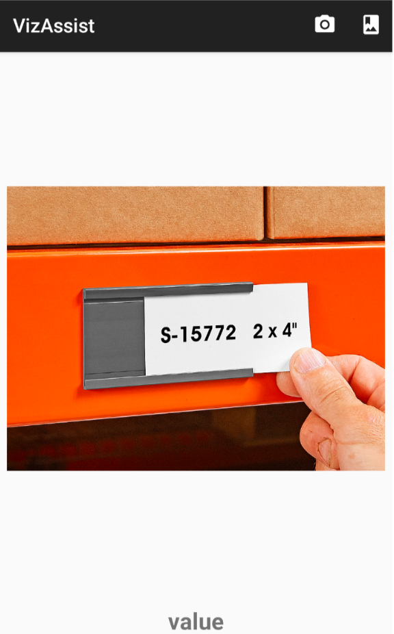

# See the Unseen
An Android app using Cloud OCR to assist text reading tasks for users with vision impairment.

### Purpose of this app
* Blind people are facing many visual challenges everyday, includes:
    * Identification
    * Description
    * Reading
    * Other
* I built this app to help them identify surrounding text messages easily and "see the unseen"!
 

## How it works (client-side)
First Page                 |  Result Page
:-------------------------:|:-------------------------:
  |  

* **First page**
    * Camera capture button
    * Image gallery button (upload from local)
    * Test and image placeholder

* **Result page**
    * Image captured or selected
    * Result and error message

* **What happens in between**
    * Image data accessing and packaging
    * OCR server query with image data
    * UI update with server query result

## How it works (server-side)
* Utilize an **IaaS** service model in Google Compute Engine
* build an docker container with Tomcat image to run our server-side application in GCE Virtual Machine

